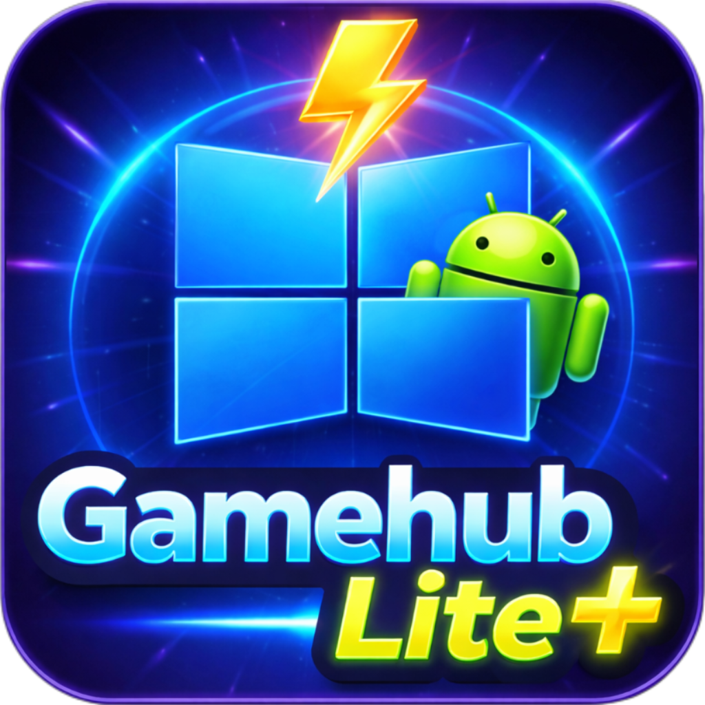

  

  
  
  
  

# GameHubLite-Plus

🔥 **GameHubLite Plus (GHLP)** a été conçu pour repousser les limites matérielles et franchir les barrières entre PC et smartphone (**SANS ROOT**), garantissant les performances maximales possibles lors de vos sessions de jeu prolongées.

Il hérite de tous les avantages de [GameHub Lite](https://github.com/Producdevity/gamehub-lite/releases) par rapport à l'application originale :
* 🚫 **Zéro télémétrie :** Suppression de 11 838 fichiers de tracking.
* 🔒 **Confidentialité et Liberté :** Suppression des 31 permissions invasives, pas de login obligatoire et fonctionnement 100% hors ligne.
* 🪶 **Poids Plume :** Taille de l'APK réduite de 114 Mo à environ 50 Mo.

🆙 **Performances et Stabilité**
GHLP offre des performances et une stabilité supérieures par rapport à :
* GameHub / GameHub Lite
* Winlator / Winlator Ludashi
* GameNative / GameNative Performance

---

## ⚠️ Avertissement Important

> **TOUTE UTILISATION SANS LA CONFIGURATION MINIMALE REQUISE PEUT ENTRAÎNER UNE DÉTÉRIORATION DU MATÉRIEL (Surchauffe Batterie / SoC / Écran).**

### 🧠 Configurations Système

| Composant | 🟢 Minimale | 🔵 Recommandée |
| :--- | :--- | :--- |
| **Système d'exploitation** | Android 14 | Android 15 |
| **Processeur (SoC)** | Snapdragon 870 | Snapdragon 8 Gen 3 |
| **Puce Graphique (GPU)** | Adreno 650 | Adreno 740 |
| **Mémoire Vive (RAM)** | 12 Go LPDDR5 | 16 Go LPDDR5X |
| **Stockage interne** | UFS 3.1 | UFS 4.0 |
| **Refroidissement** | Refroidisseur externe 20 Watts | Refroidisseur externe 30 Watts + Plaque de dissipation thermique smartphone |

---

## 📦 Versions Disponibles

GameHubLite Plus est proposé en deux déclinaisons distinctes pour s'adapter au mieux à votre appareil :

* 🌍 **Version Global :** Conçue pour tous les modèles de smartphones possédant au moins la **Configuration MINIMALE** requise. Elle offre une compatibilité universelle et stable.
* 🔴 **Version REDMAGIC :** Exclusivement développée et optimisée pour les utilisateurs d'appareils **REDMAGIC**. Cette version dédiée débloque le plein potentiel du matériel en intégrant des fonctionnalités avancées comme l'**AI Frame Generation**, la **Super Resolution**, et des optimisations exclusives au système.
   
---

## ➕ Les Plus Exclusifs à GHLP

* 🇫🇷 **Interface :** Traduite en Français à 95%.
* 📝 **Correction :** Prise en compte de la régression des performances (GH 5.3.X).
* 🚀 **VRAM Étendue :** Augmentation de la limite de VRAM allouée (6 GB, 8 GB, 12 GB, et 16 GB).
* 🎮 **Boutique en ligne :** Accès direct à la bibliothèque Epic Games Store.
* ⚡ **Architecture UMA :** GHLP inclut une configuration universelle optimisée DirectX 11/12 en appels Vulkan, afin d'exploiter pleinement la puissance de votre SoC et de votre architecture à mémoire unifiée pour l'exécution de jeux PC.
* 🪫 **Énergie :** Permet à l'application d'être exclue des optimisations batterie restrictives d’Android.

### [🎯 GHLP Cores : Reconnaissance Native AAA](https://spetnaz971.github.io/GameHubLite-Plus/GHLP_Cores_by-SpetNaz971.html)
Android traite **NATIVEMENT** GHLP comme un jeu vidéo AAA :
* **Détection Intelligente** : Reconnaissance automatique des moteurs de jeu (Unity, Unreal, DirectX, VKD3D) pour des profils de performance optimisés.
* **Ressources Débridées :** Optimisation de l'allocation CPU, GPU et RAM pour maintenir des fréquences élevées stables et empêcher le bridage thermique (*thermal throttling*).
* **Priorité Native :** Appliquée aux threads exécutés dynamiquement.
* **Liberté de Framerate :** Empêche Android d'imposer son propre cap de FPS par-dessus l'environnement Wine-Proton.
* **Cadencement Fluide :** Micro-ajustements dynamiques continus qui réduisent drastiquement les saccades et la latence.
* **Gestion Thermique Améliorée :** Contrôle progressif de la température avec ajustement automatique de la cible (45 FPS à chaud, 60 FPS à froid) pour éviter le *thermal throttling* brutal.
* **Efficacité Énergétique :** Optimisation réduisant la consommation de la batterie et prolongeant vos sessions de jeu.

### 🖼️ Opti'Frame Generation
* **6 préréglages disponibles :** ECO / FLOW / BAL (par défaut) / BOOST / CLEAR / MAX.
* La sélection d'un préréglage charge automatiquement les valeurs de *flowScale* et du modèle d'IA.
* Les profils **ECO/FLOW/BAL/BOOST** utilisent le modèle *Standard* (plus économique).
* Les profils **CLEAR/MAX** utilisent le modèle *Clear* (traitement du flux optique plus intensif avec moins d'images fantômes).
> *⚠️ Snapdragon recommandé : Cette option peut apparaître sur les appareils non Adreno, mais la qualité de la génération d'images et les performances varient selon le pilote.*

> [!TIP]
> 🧪 Ce n'est pas l'AI FrameGen de GameHub ❌ : **Opti'FrameGen est une implémentation propre à GameHubLite Plus** pour une génération d'images optimisée ARM de niveau PC, pensée par moi ([SpetNaz971](https://github.com/Spetnaz971)).
>

### 🧰 Gestionnaire de Composants
*(Accessible via le menu de gauche → Composants)*
Vous donne un contrôle total sur les composants utilisés par GHLP. Injectez ou supprimez à la volée DXVK, VKD3D, Box64, FEXCore et les Pilotes GPU (qui apparaissent dans les paramètres par jeu).

🔗 **5 sources intégrées pour télécharger vos composants et pilotes :**
* [Arihany WCPHub](https://github.com/Arihany/WinlatorWCPHub?tab=readme-ov-file)
* [Pilotes GPU Whitebelyash](https://github.com/whitebelyash/freedreno_turnip-CI/releases)
* [Pilotes GPU StevenMXZ](https://github.com/StevenMXZ/Adreno-Tools-Drivers/releases)
* [Pilotes GPU K11MCHI](https://github.com/K11MCH1/AdrenoToolsDrivers/releases/)
* Pilotes GPU MTR 

### 👾 Support Natif des Optimiseurs Android
GHLP est reconnu et soutenu par les systèmes suivants :
* RedMagic GameBooster 
* Samsung Game Booster (GOS)
* Xiaomi Game Turbo
* OPPO/Realme HyperBoost
* Qualcomm Snapdragon Game Space
* MediaTek DuraSpeed

---

## 💬 Foire Aux Questions (FAQ)

### 👨🏾‍🏫 Qui suis-je ?
Juste un passionné issu des Antilles Françaises avec 15 années d'expérience en informatique ✌🏾 (et streamer de temps à autre). 
Après avoir utilisé Winlator de manière intensive pendant plusieurs années, j'ai exploré d'autres applications basées sur le même fonctionnement (GameHub, GameNative, Winlator Ludashi, etc.). 

Je me suis débarrassé de ma console de salon car je suis persuadé que le monde de l'émulation arrive à son paroxysme : tous les jeux qui se lancent sur PC seront bientôt exécutables sur des SoC mobiles performants. J’ai décidé de créer mon propre fork car GameHub reste, selon moi, l'application la plus intuitive à utiliser, même pour un débutant, sans oublier son incroyable communauté sur YouTube et Reddit.

### 🏷️ Pourquoi ce nom "GameHubLite Plus" ?
J'ai volontairement ajouté uniquement le mot **"Plus"** au nom de mon projet car cela reste un fork. Je respecte énormément le travail de l'équipe originale de GameHub Lite. J'utilise d'ailleurs l'API officielle de GameHubLite pour mon projet.

### 💰 Est-ce que GHLP est gratuit ?
**OUI, TOTALEMENT !** 👍🏾 Le projet est 100% gratuit. Évidemment, seuls les jeux que vous possédez (achetés sur Steam, Epic Games Store, etc.) restent à votre charge depuis les plateformes officielles.

### 🔄 Quelle est la différence avec GH, GHL, etc. ?
* 🇫🇷 **Interface :** Traduite en Français à 95%.
* [🎯 **GHLP Cores (Exclusif)**](https://spetnaz971.github.io/GameHubLite-Plus/GHLP_Cores_by-SpetNaz971.html) **:** C'est ce qui fait toute la différence au niveau des performances :
    * Détection intelligente des moteurs (Unity, Unreal, DirectX, VKD3D) **NATIVE**.
    * **Ressources Débridées :** Optimisation de l'allocation CPU, GPU et RAM pour maintenir des fréquences élevées stables et empêcher le bridage thermique (*thermal throttling*).
    * **Priorité Native :** Appliquée aux threads exécutés dynamiquement.
    * **Liberté de Framerate :** Empêche Android d'imposer son propre cap de FPS par-dessus l'environnement Wine-Proton.
    * Micro-ajustements dynamiques pour un cadencement fluide **NATIF**.
    * Régulation thermique progressive et ajustement automatique **NATIF**.

* 🧪 **Opti'FrameGen (Exclusif) :** Technique de génération d'images qui respecte conceptuellement et techniquement la norme actuelle sur PC tout en étant optimisée ARM.

* 📋 **Configuration universelle :** Directement fournie et pré-optimisée *⚠️Snapdragon hautement recommandé⚠️*.

  ### 🎚️ Un smartphone avec 6/8 Go de RAM + RAM Étendue (VIRTUELLE) est-il suffisant ?

**Nuance importante !** La **RAM VIRTUELLE** n'est absolument pas aussi rapide que la **RAM RÉELLE**. Dans un environnement lourd et complexe comme celui de GHLP (combinant WINE, FEX, Proton, DXVK, etc.), abuser de la RAM virtuelle peut même s'avérer totalement **contre-productif**.

* **Un simple filet de sécurité :** La RAM-Virtuelle n'est exploitée nativement que par le **système d'exploitation (Android) pour éviter le crash** d'applications basiques en arrière-plan.
* **Le Mythe des constructeurs :** 🤡**LA RAM VIRTUELLE NE FAIT PAS GAGNER EN PERFORMANCES**.🤹🏾‍♂️ C'est un pur argument marketing des constructeurs, malheureusement alimenté et répandu par ignorance sur le net.

> ⚠️ **Pas de miracle :** Même avec toute la Ram-Virtuelle du monde, le moteur **GHLP Cores** ne pourra rien faire si votre configuration matérielle réelle (vrais composants physiques) ne respecte pas la configuration minimale requise.
> 

### 📥 Où puis-je télécharger GameHubLite Plus ?
Simplement sur notre serveur Discord officiel, accessible sur demande ! 

## Crédits

• **GameHubLite** - [Python](https://github.com/) (Créateur original de GameHub Lite) et [Producdevity](https://github.com/Producdevity/gamehub-lite) (Responsable actuel)

• **Intégration Epic** - [L'équipe GameNative](https://github.com/utkarshdalal/GameNative), le pipeline de la boutique, le flux d'authentification, l'architecture de téléchargement et la synchronisation de la bibliothèque dans GameHubLite Plus sont basés sur leurs recherches et leur implémentation.

• **Gestionnaire de Composants** - Inspiré de la technique de [The412Banner](https://github.com/The412Banner).
